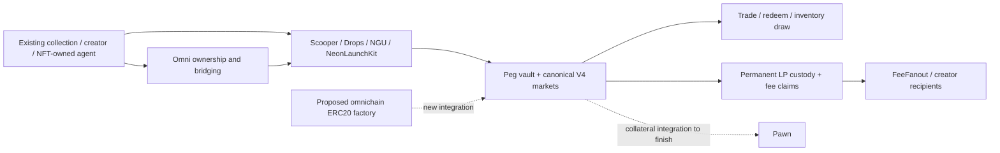

# Ecosystem comparison and omnichain launch design — 23 September 2026

Implementation follow-up: the requested local Hookr fork is at
[hookr-omni](/Users/stacc/hookr-omni/FORK.md), with the
[portable-stack and omnichain implementation notes](/Users/stacc/hookr-omni/omni/README.md).
Its Robinhood stack deployment rehearsal passed without broadcasting: 25 simulated
transactions, 40.35 million estimated gas, and a sampled displayed requirement of
0.00414 ETH. This is a shared-stack gas estimate, not the all-chain token-launch price.
The source comparison below remains a separate assessment of existing product coverage.

PoolManager follow-up: **28 of 29 chains now have identified live managers**,
including 11 existing user-owned OmniGods deployments missed by the initial
official-registry-only lookup. GUNZ remains unresolved. See the
[manager address and verification matrix](/Users/stacc/hookr-omni/omni/research/manager-resolution-2026-09-23.md).
This does not clear the separate transport, periphery or aggregator requirements.
The subsequent [stack rehearsal sweep](/Users/stacc/hookr-omni/omni/research/stack-rehearsals-2026-09-23.md) passed on 27 chains. Ronin remains blocked by RPC rate limits; GUNZ lacks a verified manager. These are local EVM fork rehearsals, with no broadcasts.

The strongest coherent product in these repositories is a creator-operated asset lifecycle: create or import an asset, establish a market, distribute the proceeds, move ownership between chains, and let either a wallet or an NFT-owned agent operate it. The principal unfinished work is connecting the latest implementations into that lifecycle. Several neighboring product categories also remain substantially untouched.

This assessment reads xgas-app, staccpad-ai and its linked nft-range contracts, deployment journals and public first-party documentation. It is a source and deployment-history comparison, not a new transaction rehearsal or security audit. “Present” means implementation evidence; “recorded deployed” means local successful receipt records. External live status below is attributed to the publisher. No transactions were sent.

**The relationship and timeline**

Clutch identifies StonkBrokers as its flagship and unVault as a client build. That connects their engineering ecosystem; it does not establish one owner, budget or treasury. Its self-reported sequence is prediction/gaming products in 2024–25, unVault among partner builds in Q3–Q4 2025, StonkBrokers/Anvil/Clock In on 17 July 2026, and Broker Box on 31 July. The homepage's 29 August exchange/options milestone is a dated roadmap entry, not proof that both products shipped then. [Clutch portfolio and timeline](https://www.clutch.markets/)

| Period | Public milestone | Relevant evidence in your workspace |
|---|---|---|
| Q3–Q4 2025 | unVault appears in Clutch's client-build timeline | Your Omni implementation now covers collection portability and ownership continuity, with local cross-chain deployment and pilot records. |
| July 2026 | StonkBrokers, Anvil, Clock In and Broker Box rollout | Your Peg, launchers, lockers, fee distribution and gacha cover several related primitives. Product packaging differs. |
| 19–21 September 2026 | Interns mint/activation on the 19th; Clock In 3 on the 21st | You have real token-bound accounts, but the specific Interns screen remains a prototype. [Interns whitepaper](https://www.stonkbrokers.io/docs/interns) |
| September 2026 | STORMM options described as private testing/coming soon | No equivalent options lifecycle found. [Options page](https://www.stonkbrokers.io/options) |
| 16–22 September 2026 | Your visible repository development window | nft-range history progresses through markets/launching, Omni/Neons, lending, Peg revisions, then additional launchers, games and intents. The git window establishes recorded work, not a from-scratch development-time claim. |

The latest Stonk documentation describes the launcher, exchange, InternExchange and gauge staking as live, with the voting suite and community box factory still pending. Older portfolio/whitepaper pages lag those statuses. [Current Stonk docs](https://www.stonkbrokers.io/docs)

**What already fits together**

1. **Bring an existing collection into a liquid market.** Scooper, PegFactory, PegVaultV2, PegRouter and PegLocker form a substantial implementation path. The useful product is a creator-facing transaction plan: what inventory enters, what quote assets are needed, which positions are created, who owns the receipts and which fees remain. Scooper deals with assets the caller controls; it is not a mechanism to withdraw somebody else's locked liquidity. [Scooper](/Users/stacc/nft-range/src/peg/Scooper.sol), [PegFactory](/Users/stacc/nft-range/src/peg/PegFactory.sol:182)

2. **Launch directly into usable liquidity.** PumpDrop, the staged/drop contracts, NGU companions and NeonLaunchKit cover different launch mechanics. PumpDrop has reversible reserve-backed purchases before graduation; NeonLaunchKit can open multiple quote markets from an NFT account. Presenting these as a few clearly different launch choices would be more coherent than another independent launcher tab. [PumpDrop](/Users/stacc/nft-range/src/drop/PumpDrop.sol), [NeonLaunchKit](/Users/stacc/nft-range/src/neons/NeonLaunchKit.sol:121)

3. **Portable ownership plus an operating account.** Omni, token-bound accounts, Neons and x402-funded inference can connect the owner, asset and operator. This is more useful when the same account can launch, hold fee receipts and act on its creator's permissions. The route table is broader than the account implementation's chain mapping: portability and account execution must be checked separately. [OmniAccount](/Users/stacc/nft-range/src/omni/OmniAccount.sol:74), [Neons client](/Users/stacc/staccpad-ai/src/contracts/neons.ts)

4. **Interoperate with their assets as well as compete for launches.** StonkPegOracle and DeployStonkMorpho already connect Anvil's published peg data to Morpho markets. This is existing complementary work, not an untouched opportunity. The oracle uses the venue's declared notional; that is different from proving an executable liquidation price or sufficient lending liquidity. [Oracle](/Users/stacc/nft-range/src/oracle/StonkPegOracle.sol), [Deployment script](/Users/stacc/nft-range/script/DeployStonkMorpho.s.sol)

**Coverage and remaining gaps**

| Capability | Your evidence | What remains |
|---|---|---|
| NFT inventory markets | PegVaultV2, canonical V4 pools, routing, specific/random redemption | One consistent onboarding and migration experience; fee and supply displays must use the current vault version. |
| Launches and graduation | Drops, PumpDrop, NGU, NeonLaunchKit | An omnichain fungible genesis and distribution system; chain-by-chain launch readiness. |
| NFT portability | Omni contracts; 20-chain expansion added to five existing deployments; recorded Avalanche–Zora pilot round trip | The registry has 29 networks but only 25 without a listed blocker. Do not equate a configured route, a successful quote and a tested transfer. Solana-native implementation not found. |
| Lending | Pawn, lender shares, liquidation/claim tickets; Stonk-to-Morpho integration | Current Pawn pool creation requires the legacy trusted hook. Latest PegFactory creates hookless pools. Their direct connection is unfinished. |
| LP custody | PegLocker permanently holds canonical V4 positions with transferable fee receipts | Generic timed locks, linear vesting and V3/up. adapters. Neons' Doppler vesting integration does not fill this whole category. |
| Fee distributions | FeeFanout and fee collection/indexing | Per-collection reward elections, activation tiers, parent/child allocation and token-bound payroll. |
| Intern experience | Reachable Interns UI, alongside real account primitives elsewhere | Roster and clock-in balances in this screen are local state; account previews are simulated. It is not a deployed rewards engine. |
| Inventory games | Random vault redemption, GachaHelper, ReelKit, Wagers | Stock-backed prize certificates, coordinated inventory replenishment and the full Broker Box product are not established by NFT random redemption. |
| Agent tools | Neons, MCP, x402, support automation, BurnPR | A single agent interface for the whole NFT lifecycle; portable skill registry, bounty settlement and on-chain action receipts. |
| Exchange incentives | LP positions and fee routing | ve voting, gauge incentives/bribes and emissions governance are a separate implementation. |
| Derivatives | Trading, funded games and lending components | Calls/puts, exercise/expiry/settlement, perpetual margin/funding and event-oracle prediction markets are distinct missing systems. |
| Naming | NFT identities and token-bound accounts | A general name registry, reverse resolution, renewals and name trading. |

Stonk's distinguishing adjacent pieces include a broader locker, exchange incentives, a broker/intern reward system and inventory-backed Broker Box machinery. These are product differences beyond an NFT AMM. [Stonk product documentation](https://www.stonkbrokers.io/docs)

unVault combines mobility/royalty infrastructure with DIVIT campaign participation and allocation. An equal-per-NFT fee splitter does not implement campaign verification or configurable participation rules. Its own marketplace page still presents proprietary marketplace functionality as forthcoming; that says nothing about Anvil's separate live status. [unVault whitepaper](https://www.unvault.com/whitepaper), [DIVIT](https://www.unvault.com/divit), [marketplace](https://www.unvault.com/marketplace)

ApeClaw adds an agent-skill and receipt/bounty direction, with several features labeled alpha. LAURA's page is insufficient evidence of an operating growth engine. These are adjacent reference points, not reasons to duplicate every agent product. [ApeClaw](https://apeclaw.ai/), [LAURA](https://laura.stonkbrokers.io/)

**Three concrete unfinished joins**

- **Peg → Pawn:** [PegFactory](/Users/stacc/nft-range/src/peg/PegFactory.sol:246) sets a zero hook; [Pawn](/Users/stacc/nft-range/src/pawn/StaccpadPawn.sol:153) resolves collateral through a trusted hook and its market registry. A new collateral integration needs an explicit valuation/liquidation model for the current pro-rata vault.
- **Omni → account execution:** [OmniAccount.eidOf](/Users/stacc/nft-range/src/omni/OmniAccount.sol:74) covers the original five chains. The expanded collection network registry is not evidence that all corresponding accounts can execute across that set.
- **Fees → useful rewards UI:** [Interns roster](/Users/stacc/staccpad-ai/src/components/Ccff00InternsModal.tsx:84), [simulated accounts](/Users/stacc/staccpad-ai/src/components/Ccff00InternsModal.tsx:120) and [clock-in handler](/Users/stacc/staccpad-ai/src/components/Ccff00InternsModal.tsx:199) show the missing runtime. Build and connect the actual reward accounting before presenting these balances as earned funds.

**Economics that should be compared accurately**

Anvil's documented V3 deployment default is 1 ETH on Ethereum/Base/Robinhood and 10,000 APE on ApeChain, subject to live configuration. It also has recurring fee mechanics. [Anvil documentation](https://anvil.clutch.market/docs)

Your current createMarket function has no comparable payable factory levy. Your stack still charges other fees: configurable vault burn/redemption mechanics and PegLocker's default 10% share of collected LP fees, among others. A competitive quote should compare the user's complete path and continuing charges. [PegVaultV2](/Users/stacc/nft-range/src/peg/PegVaultV2.sol), [PegLocker](/Users/stacc/nft-range/src/peg/PegLocker.sol)

For the revenue-rate argument, qualified deployments diverted per week × probability they otherwise purchased × applicable net fee is a defensible starting model. A DM lead is not automatically one foregone 1 ETH sale. None of this establishes their private hiring motive or willingness to pay for a pause in your work.

**Suggested order**

1. Finish one creator-to-market flow with the current contracts, accurate quote/fee previews and receipts.
2. Finish the Peg collateral integration and align the bridge/account chain matrix.
3. Ship the omnichain token launch layer described below if this is the next creator product. It reuses existing work more directly than a separate derivatives vertical.
4. Add a real configurable reward router and connect the current prototype UI.
5. Add locker variants or campaign payouts only where actual users need them. Treat options, perps and prediction markets as separate products with separate validation work.

**Omnichain token launch: supply, venues and Hookr**

The proposed genesis is coherent: N predetermined chains, each allocated 1 billion tokens, for a global 27B or 28B genesis supply. After launch, a burn/mint bridge moves supply rather than creating another genesis allocation. For a burn/mint design, the useful accounting identity is:

`sum(local supplies) + transfers burned but not yet credited = genesis supply − permanent burns`

A chain may subsequently hold more than its initial 1B. New chains should receive bridged allocations unless supply expansion is explicitly intended. Pool balances, wallet balances and tokens in flight need separate presentation. LayerZero's OFT supports debit/credit transfers; the genesis policy remains your application's responsibility. [OFT standard](https://docs.layerzero.network/v2/developers/evm/oft/quickstart)

Matching token addresses are independent of matching hook addresses. CREATE2 needs the same factory, salt and init-code hash; changing endpoint addresses in constructor arguments changes that hash. Keep chain-specific transport configuration outside the token's identical creation code, or use another deterministic deployment pattern. EVM compatibility must be checked per chain, particularly chains with a different native deployment model. [CREATE2 specification](https://eips.ethereum.org/EIPS/eip-1014), [LayerZero deterministic deployment guidance](https://docs.layerzero.network/v2/developers/evm/tooling/uniform-address)

Direct-to-pool avoids maintaining 28 separate pre-graduation market states. A one-sided concentrated token-sale position can open without supplied quote capital, but it has no quote reserve to pay sellers until purchases fund it. Broad routing still depends on supported chains, venues and indexing. There is no universal aggregator listing created by CREATE2.

If curves are retained, define graduation per chain or as an asynchronous global process. Do not leave it ambiguous. External bridged supply must be accounted for in the curve's inventory and redemption rules; bridging cannot create reserve backing. A single global graduation transaction across independent chains is not provided by ordinary bridge messaging.

Hookr is an existing V4 launch stack. Its architecture lists twelve addresses in the default release plus four already-deployed linked libraries. The root is not a standalone launcher. A cross-chain port must supply its dependency graph and chain-specific bindings; shared infrastructure is deployed once per chain, while each token launch adds its own token, pool/configuration and positions. Your own launcher can replace the coordinator only by replacing its registration/admission work as well. [Hookr architecture](https://hookr.fun/docs/concepts/architecture)

Three viable venue choices:

| Choice | What it means for this project |
|---|---|
| Standard V3 or hookless V4 on supported chains | Smallest additional venue dependency; keep your token and transport design independent. |
| Hookr on Robinhood, standard pools elsewhere | Same fungible token; different local market rules. No requirement that every chain run the same hook. |
| Hookr-style markets everywhere | Port the relevant shared stack, or independently implement a narrower hook carrying only the wanted mechanics. Each deployment needs its own compatibility verification. |

Hookr reports its default root was approved for Uniswap routing in September; the recapture roots are separate and unsubmitted. Approval does not automatically extend to another chain or modified deployment. [Routing status](https://hookr.fun/docs/integrations/hooklist-and-routing)

Its existing-token lane accepts an externally created token but opens an empty pool, without the new-token guard or founding position. That is the natural starting point for your own omnichain asset, with liquidity/launch protections supplied separately. [Existing-token guide](https://hookr.fun/docs/guides/open-an-existing-asset-market)

The current fee model takes its protocol share from optional add-ons rather than the base LP fee. Select mechanics for their usefulness to the market; more hooks do not inherently improve routing. [Fee model](https://hookr.fun/docs/concepts/fee-model)

The WTH recapture integration operates inside a local swap against local venues. It does not make cross-chain arbitrage atomic. For this launch, I would start with standard pools or the default Hookr root and assess recapture separately. [Recapture design](https://hookr.fun/docs/concepts/arbitrage-recapture)

**Deployment cost: evidence and a provisional budget**

Your existing records provide a closer benchmark than generic deployment-price guesses:

| Recorded workload | Cost at the saved 20 September native-token prices | Limits |
|---|---:|---|
| Omni core expansion: 180 recorded transactions across 20 additional chains | $7.32 | Excludes the five original chains, route configuration, funding and messages. |
| Confirmed route-configuration journals: 2,809 transactions across 25 chains | $12.31 | Sum of recorded gasCost for confirmed entries; not a fresh chain reconciliation or assertion every route is active. |
| Recorded Avalanche → Zora NFT message | About $0.51 | Message value only, excluding source gas; not an OFT quote. |
| Recorded return message | About $0.58 | Same qualification. |

Sources: [core completion record](/Users/stacc/nft-range/deployments/omni-expansion/core-completion-audit.json), [saved prices](/Users/stacc/nft-range/deployments/omni-expansion/native-usd-prices.json), [route journals directory](/Users/stacc/nft-range/deployments/omni-expansion), [round-trip record](/Users/stacc/nft-range/deployments/omni-expansion/bridge-round-trip-audit.json). The earlier $14.95 route figure was a planning estimate; the $12.31 figure above sums confirmed journal entries.

For a first simple token/bridge/pool prototype over supported low-cost EVM chains, **$100–$300 is a provisional funding envelope for deployment, configuration and a small number of test transfers**, not a measured launch quote or an all-in build cost. The historical numbers suggest actual gas could be lower. This envelope does not quote a complete Hookr port, custom bridge infrastructure on unsupported chains, liquidity capital or development/review work. Compiled transactions and route-specific fees are needed to price those.

The estimate should be calculated as chain-by-chain deployment/configuration gas, plus data fees, message quotes, funding-transfer costs and a contingency. At 28 chains, a full mesh has 756 directed paths; a Robinhood hub has 54 directed paths but remote-to-remote transfers take two hops. Configuration work can be batched and shared; 756 paths does not mean 756 deployments.

LayerZero charges for the configured message verification/execution path and exposes fee quotes. Hyperlane likewise requires payment for delivery and an appropriate security/relayer configuration. Neither can be declared cheaper for these unspecified 28 paths. Given your existing LZ deployment work, it is the shorter integration path here; that is an engineering-reuse judgment. [LayerZero fees](https://docs.layerzero.network/v2/developers/evm/configuration/gas-fees), [Hyperlane delivery payments](https://docs.hyperlane.xyz/docs/protocol/core/interchain-gas-payment)

**Arbitrage and the “one block plus” premise**

Bridge settlement is asynchronous: source confirmation, verification, delivery and destination inclusion. Independent chains have no shared block clock. A trader who waits for purchased tokens to bridge bears that latency. A trader already holding tokens and quote assets on both chains can execute both local legs without waiting for the bridge, then rebalance afterward. Thus bridge latency is not a guaranteed spread-retention window.

Identical quote denominations make comparisons easier; they do not synchronize local reserves or prices. Fees, price impact, inventory costs and transport costs set the economically relevant spread. Opening 28 markets divides quote liquidity and creates inventory requirements; multiplying the token count does not multiply backing. The product advantage to test is accessible distribution and usable liquidity across chains.

**Verification boundary**

Local receipt and source evidence supports deployed implementations, including the recorded Omni pilot. A fresh read through staccpad.fun's Robinhood RPC returned nonempty code at the current PegFactory address. Other public RPC requests returned HTTP 403, so fresh execution status was not broadly established. The latest route journals also contain partial activation/check markers; those should be reconciled before advertising every possible pair. No claims here establish production security, customer conversion rates or a counterparty's financial ability.
